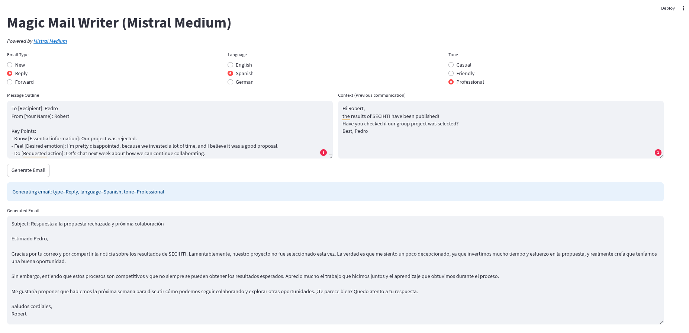

# Mistral Mailer

Generates and translates emails in different languages.

## Screenshot

## Installation
~~~
pip install -t requirements.txt
~~~
For using the Mistral API, you need an API key. from <https://console.mistral.ai/api-keys>.  
The key has to be stored in a file called `.env`:  
~~~
MISTRAL_API_KEY=here-you-place-your-api-key
~~~

## Start web app
~~~
streamlit run app.py
~~~

## License
MIT, <robertwinkler@posteo.net>
